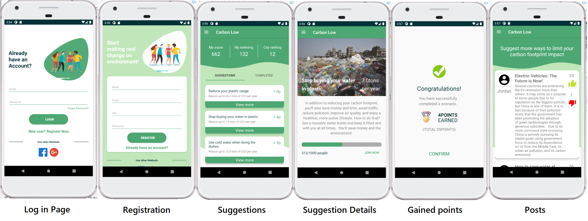
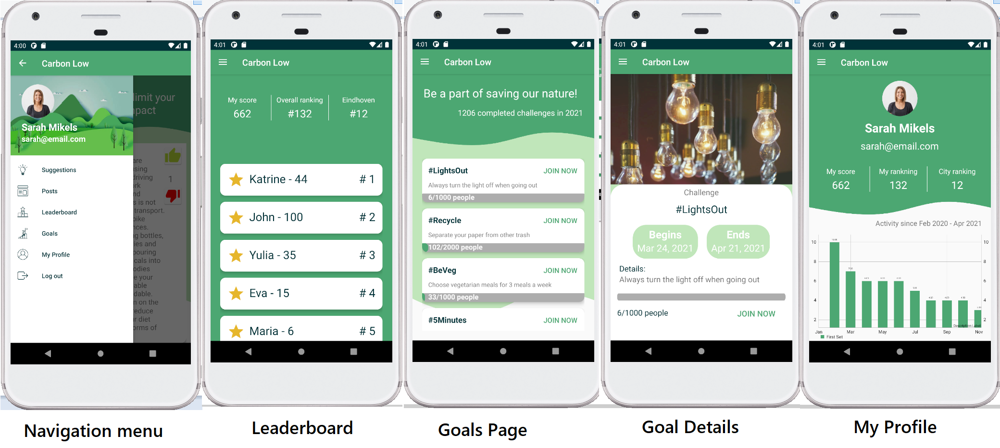

# Lower your carbon footprint
### Android Application (Kotlin)

An application that inspires users to diminish their carbon footprint left in nature.
It aims at bringing awareness of the consequences of nature pollution and give easy to follow simple steps to lower your carbon footprint, 
without putting a lot of effort or introducing many changes to your daily life.

      
 
 ### Technologies 
 * Kotlin 
 * Firebase
